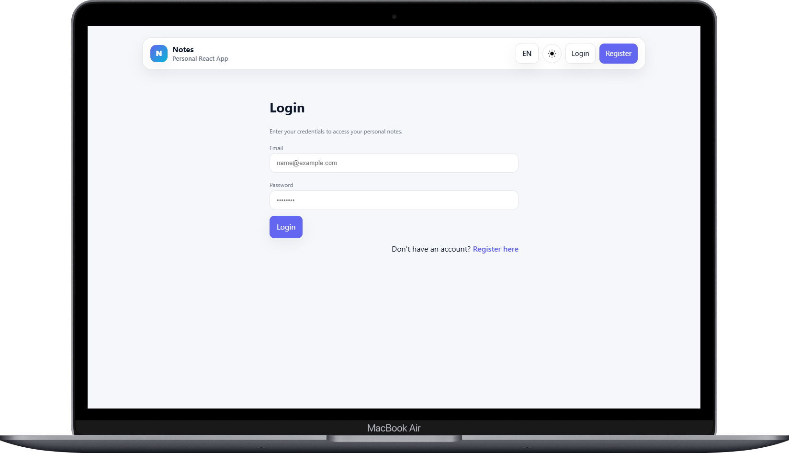
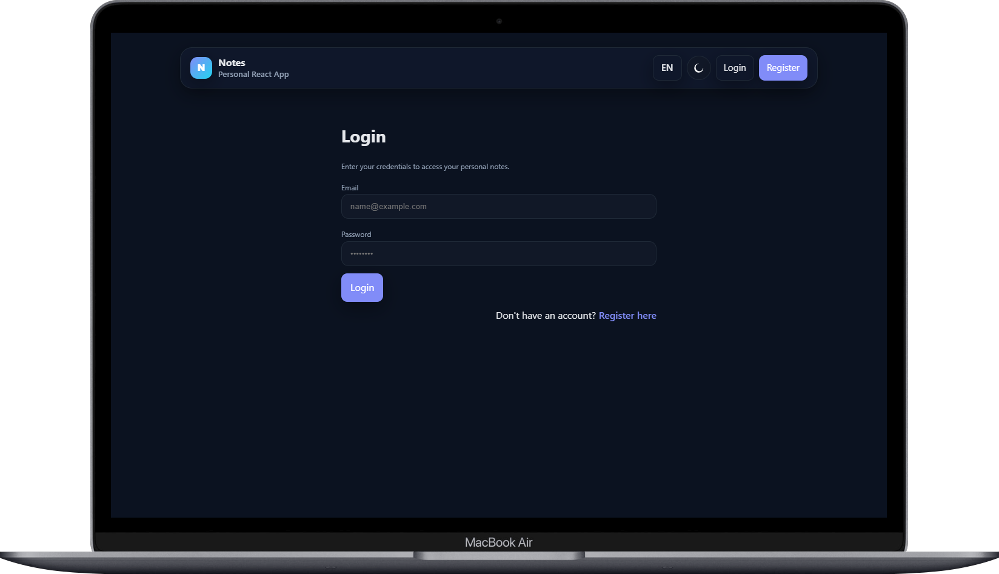
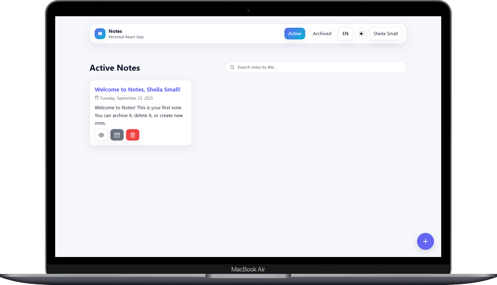
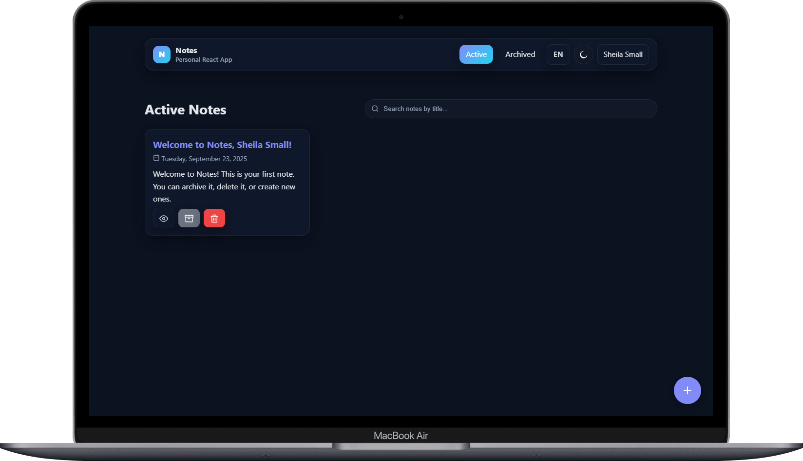

# Personal Notes App – React (SPA + API, Context, Hooks)

Aplikasi catatan pribadi berbasis **React** dengan arsitektur **SPA** yang mengimplementasikan:

- **RESTful API** (Dicoding Notes API v1) untuk semua data,
- **Autentikasi** (login/registrasi) + **proteksi halaman**,
- **React Context** (Theme & Locale) + **persist** ke `localStorage`,
- **Hooks** (state/effect/custom hooks),
- **Indikator loading**, **translation sederhana (ID/EN)**, dan **UI responsif**.

<p align="center">
  
  
</p>
<p align="center">
  
  
</p>

> Proyek ini ditujukan untuk memenuhi **_Submission Proyek: Membangun SPA + API, Context, dan Hooks_** pada kelas **Belajar Fundamental Aplikasi Web dengan React** Dicoding. Semua **kriteria wajib** dan **opsional** telah dipenuhi.

---

## ✨ Fitur Utama

- **Registrasi & Login** (token disimpan ke `localStorage`, bootstrap sesi via API).
- **Proteksi fitur catatan**: daftar, detail, tambah, arsip/aktif, hapus **hanya untuk user login**.
- **Daftar catatan aktif** & **arsip** (opsional, diimplementasikan).
- **Detail catatan**, **Tambah catatan**, **Hapus catatan**.
- **Arsipkan** / **Aktifkan** catatan — tombol mengarahkan ke daftar yang relevan.
- **Pencarian** judul (realtime filter di list).
- **Tema** gelap/terang (Context) + **persist**.
- **Bahasa** Indonesia/Inggris (Context) + **persist**.
- **Indikasi loading**:

  - Bootstrap auth (menahan render konten dengan **BootGate**),
  - Spinner pada tombol submit (**Login/Register/Add**),
  - Loading list/detail saat fetch API.

- **FAB** (tombol tambah melayang) **hanya muncul ketika login**.
- **Aksesibilitas**:

  - Counter judul dengan `aria-live="polite"`,
  - Focus management & ESC pada user menu,
  - Label & judul terjemahan sebagai `title/aria-label`.

---

## 🧱 Teknologi

- **React 18+**, **React Router**
- **Context API** (Auth, Theme, Locale)
- **Hooks** (`useState`, `useEffect`, custom hook `useInput`, dsb.)
- **Vite** untuk dev/build
- **CSS murni** (CSS variables, responsive layout)

---

## 🌐 API

Menggunakan **Dicoding Notes API v1**
`https://notes-api.dicoding.dev/v1`

---

## 📁 Struktur Proyek

> Nama file mengikuti implementasi saat ini (komponen dipisah sekecil mungkin – single responsibility).

```
personal-notes-app-with-api/
├─ docs/
│  ├─ home-screenshot-dark.png
│  ├─ home-screenshot-light.png
│  ├─ login-screenshot-dark.png
│  └─ login-screenshot-light.png
├─ public/
├─ favicon.svg
├─ src/
│  ├─ components/
│  │  ├─ auth/
│  │  │  ├─ AuthCTA.jsx
│  │  │  └─ AuthHeader.jsx
│  │  ├─ form/
│  │  │  ├─ Editor.jsx
│  │  │  ├─ ErrorText.jsx
│  │  │  ├─ Field.jsx
│  │  │  ├─ FormActions.jsx
│  │  │  ├─ SubmitButton.jsx
│  │  │  ├─ SuccessText.jsx
│  │  │  ├─ TitleCounter.jsx
│  │  │  └─ TitleInput.jsx
│  │  ├─ status/
│  │  │  ├─ NotFound.jsx
│  │  │  └─ StatusPage.jsx
│  │  ├─ AuthedFAB.jsx
│  │  ├─ AuthGate.jsx
│  │  ├─ BootGate.jsx
│  │  ├─ EmptyState.jsx
│  │  ├─ FloatingAddButton.jsx
│  │  ├─ GuestGate.jsx
│  │  ├─ HeaderBar.jsx
│  │  ├─ Loading.jsx
│  │  ├─ LocaleToggle.jsx
│  │  ├─ NoteCard.jsx
│  │  ├─ NoteList.jsx
│  │  ├─ SearchBar.jsx
│  │  ├─ Spinner.jsx
│  │  └─ ThemeToggle.jsx
│  ├─ contexts/
│  │  ├─ AuthContext.jsx
│  │  ├─ LocaleContext.jsx
│  │  └─ ThemeContext.jsx
│  ├─ hooks/
│  │  ├─ useInput.js
│  │  └─ usePrefersDark.js
│  ├─ pages/
│  │  ├─ Add.jsx
│  │  ├─ Archive.jsx
│  │  ├─ Detail.jsx
│  │  ├─ Home.jsx
│  │  ├─ Login.jsx
│  │  ├─ NotFound.jsx
│  │  └─ Register.jsx
│  ├─ utils/
│  │  ├─ date.js
│  │  ├─ index.js
│  │  └─ network-data.js
│  ├─ App.jsx
│  ├─ index.css
│  └─ main.jsx
├─ .gitignore
├─ index.html
├─ LICENSE
├─ package.json
├─ package-lock.json
├─ README.md
└─ vite.config.js
```

---

## 🚀 Menjalankan Proyek

### Prasyarat

- **Node.js** ≥ 18 (LTS disarankan)
- **npm** ≥ 9 (atau pnpm/yarn)

### Instalasi

```bash
npm install
```

### Development

```bash
npm run dev
```

Buka `http://localhost:5173` (default Vite) jika tidak terbuka otomatis.

---

## 🧩 Detail Implementasi Penting

- **HeaderBar**

  - Brand (logo huruf + judul + subjudul) **ikut bahasa**:

    - **ID**: “Catatan” – “Aplikasi React Pribadi”
    - **EN**: “Notes” – “Personal React App”

  - **Nav** (Aktif/Arsip) hanya tampil ketika **login**.
  - **User pill** menampilkan **nama**; klik untuk **dropdown Logout** (tanpa ikon), fokus & ESC terkelola.
  - **LocaleToggle** & **ThemeToggle** ada di kanan.

- **Auth (Login/Register)**

  - Form **controlled** + validasi (konfirmasi password).
  - Tombol submit menampilkan **spinner** saat `submitting`.
  - CTA di bawah form **text-only**:

    - ID: “Tidak punya akun? **Daftar di sini**” / “Sudah punya akun? **Masuk di sini**”
    - EN: “Don’t have an account? **Register here**” / “Already have an account? **Login here**”

- **Add Note**

  - `TitleField` membatasi **50** karakter + counter **live** (`aria-live="polite"`).
  - `BodyField` placeholder terjemahan:

    - ID: “Sebenarnya saya adalah ….”
    - EN: “Actually I am ….”

  - Submit menampilkan **spinner** dan kembali ke list setelah berhasil.

- **Arsip/Aktif**

  - Aksi arsip/aktif memanggil API lalu **navigate** ke daftar yang relevan (aktif → arsip, arsip → aktif).

- **FAB**

  - `AuthedFAB` hanya merender `<FloatingAddButton />` **ketika login**.

- **NotFound**

  - Halaman 404 menggunakan `StatusPage` + `NotFoundStatus` dengan terjemahan ID/EN.

---

## ♿ Aksesibilitas (A11y)

- Counter judul dengan `aria-live="polite"` dan `aria-atomic` agar screen reader mengumumkan perubahan.
- **User menu**:

  - `aria-haspopup="menu"`, `aria-expanded`, `aria-controls`.
  - Menutup dengan klik di luar & tombol **ESC**.
  - Fokus diarahkan ke item pertama saat menu dibuka.

- Kontras warna & fokus ring disesuaikan pada kedua tema.

---

## ✅ Checklist Uji Manual (sesuai kriteria submission)

**Kriteria Utama**

- [x] API Dicoding v1 digunakan untuk **semua** data (login/register, list active/archived, detail, add, delete, archive/unarchive).
- [x] **Registrasi** (name, email, password, confirm password) & **Login** (email, password).
- [x] **Access token** tersimpan & digunakan (bootstrap user via `getUserLogged`).
- [x] **Proteksi**: sebelum login hanya bisa akses `/login` & `/register`.
- [x] **Daftar catatan** aktif & arsip (opsional: **terpenuhi**).
- [x] **Detail catatan**, **Tambah**, **Hapus**.
- [x] **Arsipkan/Aktifkan** dan **redirect** ke list yang relevan.

**Kriteria Utama (Submission Sebelumnya)**

- [x] Minimal 2 halaman (list & detail) — plus add, login/register.

**Kriteria Opsional**

- [x] **Loading** state (spinner/loader di tombol & fetch data).
- [x] **Ubah bahasa** (ID/EN) dengan Context + persist localStorage.

**Tambahan**

- [x] Tema gelap/terang (Context + persist).
- [x] FAB hanya saat login.
- [x] Komponen modular & konsisten.

---

## 🧪 Model Data

```ts
type Note = {
  id: string; // dari API
  title: string; // max 50 karakter
  body: string;
  archived: boolean;
  createdAt: string; // ISO string
  owner?: string; // tergantung API (informasi user)
};
```

---

## 🌐 Deployment

Platform seperti Netlify/Vercel (preset **Vite**):

- **Build Command**: `npm run build`
- **Publish Directory**: `dist`

Tidak perlu environment variable.

---

## 👤 Penulis

- GitHub: **https://github.com/irfandwisamudra**
